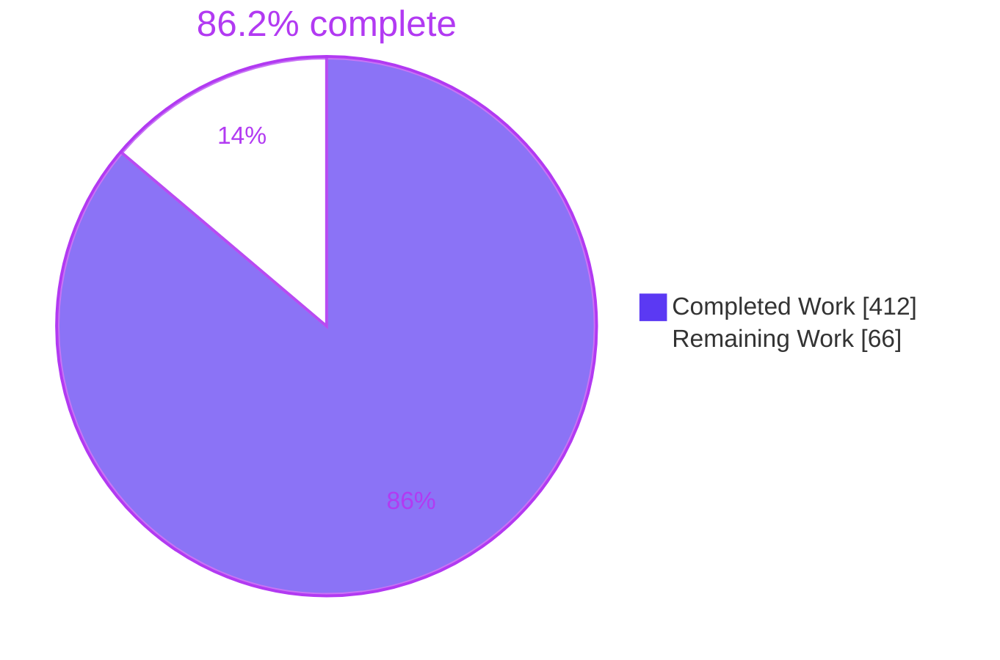
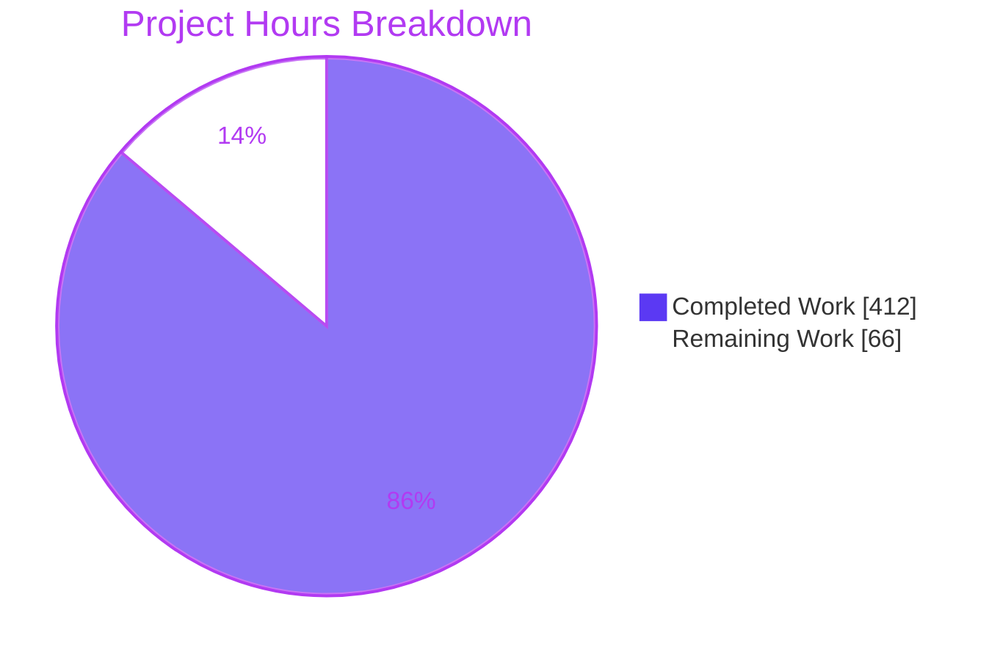
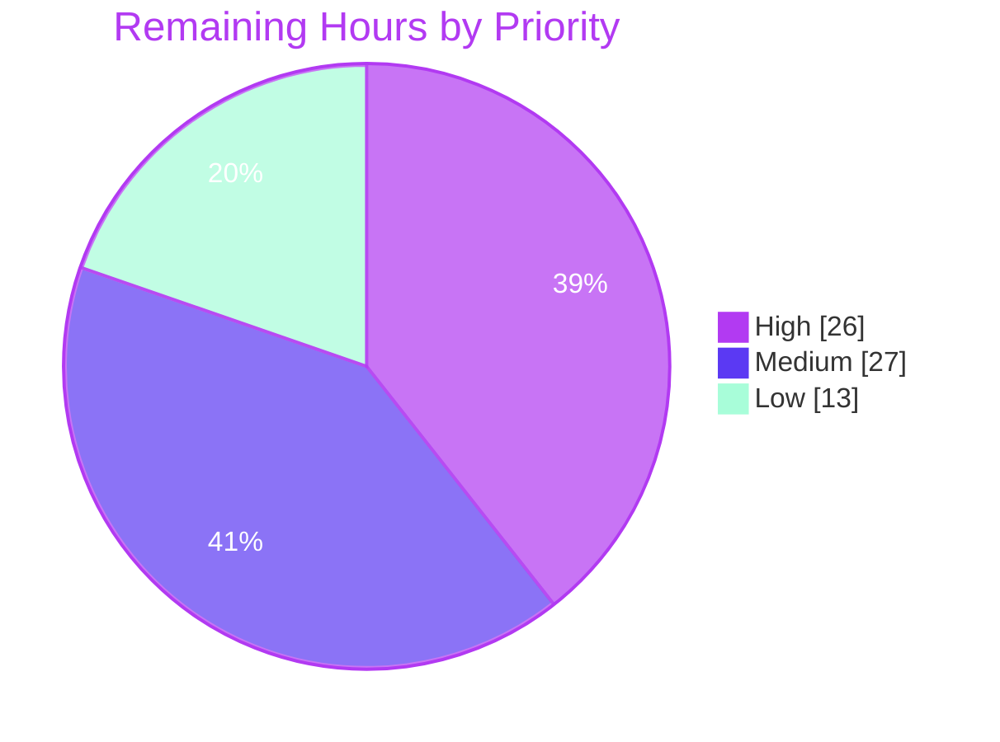

# 1. Executive Summary

## 1.1 Project Overview

This project adds F-021, a read-only HL7 FHIR R4 API to DHIS2 at `/api/fhir/**`. External EMR and HIE systems can read Tracker data as standard `Patient`, `Encounter`, `Immunization` and `Observation` resources, fetch `Patient/$everything`, and discover capabilities at `/api/fhir/metadata`. Administrators map tracked entity attributes and program-stage data elements to FHIR elements through a new `FhirResourceMapping` metadata object, its CRUD API and a settings screen. The feature ships as the Maven module `dhis-2/dhis-service-fhir`, reads only through the existing Tracker export controllers and sharing model, and stays dark until `fhir.api.enabled` is switched on.

## 1.2 Completion Status



| Metric | Value |
|---|---|
| Total Hours | 478 |
| Completed Hours (AI + Manual) | 412 (412 + 0) |
| Remaining Hours | 66 |
| Percent Complete | 86.2% |

412 hours completed out of 478 total hours = 86.2% complete. Scope is the Agent Action Plan (R1–R10) plus the path-to-production work to release it.

## 1.3 Key Accomplishments

- ✅ Read and search for four FHIR R4 resources, `$everything` and `/metadata`, serialised by HAPI FHIR 7.4.5
- ✅ Admin-configurable mapping: metadata model, CRUD, import/export, authorities and a settings screen
- ✅ Every Tracker read goes through the two named export controllers and their existing ACL
- ✅ `fhir.api.enabled` defaults to off and answers `404` on every FHIR route
- ✅ Exactly four `OperationOutcome` errors; `403` is identical for existing and unknown ids
- ✅ Mapping rules hold on every write path, in the database and at runtime
- ✅ One Tracker export deadline per FHIR operation; connections always released
- ✅ 682 FHIR tests and the 15,408-test reactor regression pass; 14,990 new lines against the 15,000 ceiling

## 1.4 Critical Unresolved Issues

All 10 AAP requirements (R1–R10) are delivered: 0 of 10 remain open. 17 caveats remain open against the delivered scope, and 2 of them gate release: the HL7 core advisory decision and the Rule 1 decision log (Section 5.2, row 8).

| Issue | Impact | Owner | ETA |
|---|---|---|---|
| HL7 core `org.hl7.fhir.utilities` 6.3.23 advisories CVE-2026-34359 and CVE-2026-55471 ship in the WAR (1) | Release blocker until accepted or upgraded; the version is pinned by the HAPI 7.4.x mandate | Security / release owner | Before release, 6 h |
| Delivery decisions missing from the Rule 1 decision log (1) | Release blocker under Rule 1; the Section 5.2 divergences are unlogged | Tech lead | Before merge, 8 h |
| HTTP test gaps (2): `gender`/`birthdate` search unit-tested only; suffixed write `501` checked at runtime only | Regressions in these paths would not fail CI | QA | 5 h |
| Deployment caveats (3): absolute URLs from the request `Host`; coupling to Tracker exception texts; flag-off `/api/fhir.json` gives anonymous callers `401` rather than `404` (no data exposed) | Proxy misconfiguration or a Tracker message change alters responses | Platform / DevOps | Staging, 6 h |
| Accepted limitations (2): mappings cannot carry attribute values (`E6012`); some identifier systems the validator accepts (`ftp:`, `mailto:`, short OIDs) fail strict HAPI validation | Functional gaps an administrator can hit | Product owner | Decision in the log |
| Build hygiene (3): `OpenApiControllerTest` heap margin; no module `log4j2-test.xml`; 10 lines of size headroom | CI flakiness, log noise, no room for follow-up tests | Build owner | 3 h |
| Settings-screen polish (5): toast overlap below 46rem, Source placeholder clipped at 1280px, same-named programs indistinguishable, unstable stage order, `406` without `Accept: text/html` | Cosmetic and API-client friction | Front-end | 6 h |

## 1.5 Access Issues

| System/Resource | Type of Access | Issue Description | Resolution Status | Owner |
|---|---|---|---|---|
| SonarCloud | CI secret | Sonar analysis runs only in CI with a repository secret; it has not run on this change | Pending first CI run | Build owner |

No other access issues were identified: the build, every test tier (including Docker/Testcontainers) and the running application were exercised without credentials beyond the default `admin` account.

## 1.6 Recommended Next Steps

1. [High] Accept or upgrade the HL7 core 6.3.23 advisories in writing.
2. [High] Add the Section 5.2 divergences and delivery decisions to the Rule 1 decision log.
3. [High] Complete maintainer review and merge through CI, including Sonar.
4. [Medium] Deploy to staging behind an ingress that normalises `Host`, then validate with a real EMR/HIE client.
5. [Medium] Load-test `$everything` and event searches on large patient histories.

# 2. Project Hours Breakdown

## 2.1 Completed Work Detail

| Component | Hours | Description |
|---|---|---|
| Module and build registration (R1, R2) | 10 | `dhis-service-fhir` reactor module after `dhis-web-api`; HAPI 7.4.5 / HL7 core 6.3.23 central versions; WAR and test registrations; Dependabot `>= 7.5` ignore; `dependency:analyze` clean |
| Feature flag and disabled chain (R7) | 14 | `ConfigurationKey.FHIR_API_ENABLED` (default `"false"`); highest-precedence `SecurityFilterChain` plus request guard answering `404` on every `/api/fhir/**` route and versioned alias |
| Error contract (R8) | 14 | `FhirApiException` with exactly four factories, `FhirResourceSerializer` (`application/fhir+json`, shared `FhirContext`, per-call parser), scoped `FhirExceptionHandler`, `FhirFallbackController` |
| Tracker read gateway (R5, R6, D15) | 32 | Same-package adapters to the two export controllers; `FhirTrackerReader` with one deadline per operation, per-program results and export-path exception translation |
| Search parameters and translation (R3) | 36 | `FhirSearchParameters` allow-lists, value parsers and attribute pre-validation; `FhirSearchTranslator` to Tracker request params with origin records |
| Mappers, value typing and logical ids (R3, R4) | 28 | Patient, Encounter, Immunization and Observation mappers; `FhirValueConverter`; composite `FhirLogicalId` |
| Patient service, controller and `$everything` (R3) | 14 | Read, search with Bundle links, `$everything` across candidate programs |
| Event-derived resources (R3) | 24 | `FhirEventResourceService` with multi-program read/search aggregation; Encounter, Immunization and Observation controllers |
| CapabilityStatement and OpenAPI (R3) | 12 | `/api/fhir/metadata` derived from usable mappings; OpenAPI output kept additive |
| Mapping model and persistence (R4) | 20 | `FhirResourceMapping`, enums and target catalogue, `FhirResourceMapping.hbm.xml`, `V2_44_25` migration with partial unique indexes, store, schema descriptor (order 1530) |
| Mapping validation and resolution guard (R4, D24) | 34 | `FhirResourceMappingValidator`, bundle hook, runtime resolution that ignores invalid and duplicate mappings, deletion vetoes |
| Mapping CRUD API (R4) | 12 | `/api/fhirResourceMappings` on `AbstractCrudController` with validating pre-write hooks, metadata export route and settings-page handler |
| Settings screen (R4) | 32 | Self-contained `fhir-settings.html`: banner, table, guided editor, server-message display, accessibility |
| Unit tests (R9) | 48 | 16 module test files, 537 tests, HAPI `FhirInstanceValidator` checks on mapper output |
| Integration tests (R9) | 52 | 8 H2 and PostgreSQL classes in `dhis-test-web-api`, including negative-authorization and request-lifecycle tests |
| Acceptance gates and runtime validation (R10, 0.8) | 30 | Enforcer, dependency analysis, HAPI-version and WAR-diff gates, line ceiling, whole-reactor regression, live WAR and browser checks |
| **Total** | **412** | |

## 2.2 Remaining Work Detail

| Category | Hours | Priority |
|---|---|---|
| HL7 core 6.3.23 advisory decision (accept in writing or validate an upgrade path) | 6 | High |
| Rule 1 decision-log entries for the Section 5.2 divergences and delivery decisions | 8 | High |
| Maintainer code review and merge of the 72-file change through CI | 12 | High |
| Staging deployment with `fhir.api.enabled = on` and ingress `Host`/scheme normalisation | 6 | Medium |
| Interoperability validation with a real EMR/HIE client and an external R4 validator | 8 | Medium |
| Production-scale performance test (`$everything`, event searches, connection hold, `tracker.export.timeout`) | 8 | Medium |
| HTTP tests for `gender`/`birthdate` search and suffixed-write `501` | 5 | Medium |
| CI hygiene: `OpenApiControllerTest` heap margin, module `log4j2-test.xml` | 3 | Low |
| Settings-screen polish | 6 | Low |
| Operator documentation (flag, proxy guidance, mapping setup) | 4 | Low |
| **Total** | **66** | High 26 · Medium 27 · Low 13 |

## 2.3 Estimation Basis

- Total project hours = 412 completed + 66 remaining = **478**; completion = 412 / 478 = **86.2%**.
- Completed hours are sized from the delivered code (6,287 lines of main Java, 781 of resources, 7,575 of tests) against the AAP estimation bands, with testing at roughly a third of development effort.
- Every AAP requirement R1–R10 is delivered, so no remaining hours are rework; all 66 are release and hardening work traceable to Section 1.4 and Section 5.2.
- Confidence: high for review, merge and test gaps; medium for the advisory decision and staging; low for performance testing, whose effort depends on production data volumes.

# 3. Test Results

All figures below come from runs on the delivered tree (commit `6a0c49ac82`) with Temurin 17.0.20.1 and Maven 3.8.1. Coverage is JaCoCo line/branch for the module's unit tier; integration tiers are not aggregated by `dhis-test-coverage` and show "—".

| Area / Category | Framework | Tests | Passed | Failed | Coverage | What This Proves |
|---|---|---|---|---|---|---|
| Mapping rules and resolution (`FhirResourceMappingValidatorTest`, `FhirResourceMappingServiceTest`) | JUnit 5, Mockito | 493 | 493 | 0 | 87.4% / 85.2% (`mapping`) | Every validator rule and accepted value type holds, and invalid or duplicate stored mappings are never used |
| Mappers, search translation, Tracker gateway, serializer, flag matcher (12 unit classes) | JUnit 5, Mockito, HAPI `FhirInstanceValidator` | 44 | 44 | 0 | 96.9% / 83.7% (root, `config`, `mapper`, `search`, `service`) | Output is valid R4, errors translate to the four specified outcomes, and one deadline spans each operation |
| Flag gating and security chain (`FhirApiDisabledTest`, `FhirApiEnabledSecurityTest`) | Spring MockMvc on H2, real `FilterChainProxy` | 41 | 41 | 0 | — | With the flag off every FHIR route answers `404` for any caller; with it on, the normal chain applies |
| Mapping CRUD, import, settings page, CapabilityStatement and fallback (`FhirResourceMappingControllerTest`, `FhirCapabilityStatementControllerTest`) | Spring MockMvc on H2 | 53 | 53 | 0 | — | Invalid mappings cannot be stored by any write path, and `/metadata`, `501` and `404` follow the stored mappings |
| Patient and event-derived resources with ACL (`FhirPatientControllerTest`, `FhirEventResourceControllerTest`) | MockMvc on PostgreSQL (Testcontainers) | 41 | 41 | 0 | — | Read, search, paging and `$everything` return mapped R4 resources, and `403`/`404`/omission follow existing sharing |
| Store, schema contract and request lifecycle (`FhirResourceMappingStoreTest`, `FhirRequestLifecycleTest`) | JUnit 5 on PostgreSQL | 10 | 10 | 0 | — | The migration matches its contract, uniqueness is atomic, and connections are released behind open-entity-manager-in-view |
| Existing generic suites absorbing the new schema (`OpenApiControllerTest` H2, `SchemaBasedControllerTest` PostgreSQL) | JUnit 5 | 463 | 463 | 0 | — | The new schema passes generic CRUD tests and the OpenAPI document stays consistent and additive |
| Whole-reactor regression, including the rows above (unit / H2 / PostgreSQL) | Surefire, `--threads 2C` | 15,408 (8,752 / 1,358 / 5,298) | 15,276 | 0 | — | No existing behaviour changed; 132 skips (7 / 6 / 119) are pre-existing `@Disabled` tests |

The feature's own classes total 682 tests (537 unit, 94 H2, 51 PostgreSQL). Supporting gates also pass: enforcer and `dependency:analyze` (35 modules clean), `spotless:check`, the HAPI tree check (no `hapi-fhir-*` artifact other than 7.4.5), and the WAR runtime diff (10 added artifacts, none changed or removed).

**Not Covered**

- `gender` and `birthdate` Patient search over HTTP: exercised by unit tests only, because no integration fixture maps those targets. Test both against a live instance before release.
- Suffixed writes such as `POST /api/fhir/Patient.json` answering `501`: checked on a running WAR, not pinned by a test.
- Settings-screen JavaScript: exercised in a browser only; there is no JavaScript test harness.
- Metadata import with `preheatIdentifier=CODE` through the bundle hook, and `/{uid}/metadata` export options beyond plain download.
- JDBC socket-timeout interplay with the deadline, and Hibernate/Spring `QueryTimeoutException` branches (unit-tested only).
- Right-to-left layouts and back/forward-cache restores of the settings screen.

# 4. Runtime Validation & UI Verification

The executable WAR (`-Pembedded`) was started against PostgreSQL 16 / PostGIS, seeded with the Tracker base fixtures and the five FHIR test mappings, and driven with `curl` and headless Chrome.

- ✅ **Start-up and migration** — the WAR boots, Flyway applies `V2_44_25`, Hibernate validates `fhirresourcemapping`, and `/api/ping` answers `200` within about 10 s.
- ✅ **Flag off (default)** — every `/api/fhir/**` route, including `/api/44/fhir/…`, `POST` and anonymous calls, answers `404` with a `not-found` `OperationOutcome`; `/api/fhirResourceMappings` still answers `200`.
- ✅ **Authentication (flag on)** — Basic and session logins reach the API; anonymous XHR calls get the platform `401`, and other anonymous calls get the platform `302` to `/login/`.
- ✅ **Patient** — `GET /Patient/dUE514NMOlo` returns the mapped identifier, family and given name; `Patient?family=rain` returns a `searchset` with request-based `fullUrl`s; `Patient/QS6w44flWAf/$everything` returns Patient, Encounter, Immunization and Observation.
- ✅ **Encounter, Immunization, Observation** — reads by composite id and `?patient=` searches return valid resources (status translation, coded class and vaccine, `valueQuantity`, `lotNumber`, encounter references); `_count` paging is exact.
- ✅ **CapabilityStatement** — `/api/fhir/metadata` lists only mapped types, their supported search parameters, search-parameter combinations and `Patient/$everything`, and reflects new mappings without a restart.
- ✅ **Error contract and headers** — unknown parameters and missing `patient` give `400 invalid` naming the parameter; malformed ids and unknown paths `404`; unmapped types, `Condition` and writes `501`. Every FHIR response carries `application/fhir+json;charset=UTF-8`, `Cache-Control: no-store, private` and `nosniff`. `403` is exercised by the PostgreSQL integration tier rather than on the WAR.
- ✅ **Deadlines** — with the Tracker or mapping tables locked and a 1 s `tracker.export.timeout`, Patient and event reads, searches and `$everything` answer the platform `504` WebMessage in bounded time and log one WARN each.
- ✅ **Settings screen** — in Chrome, the banner reports the flag state, five mappings list with Edit/Delete, the editor narrows targets and sources, and a duplicate Patient mapping is rejected with the server's `409` message in a focused live region; nothing is stored.
- ⚠ **Never exercised at runtime** — a real EMR/HIE client, a TLS-terminating reverse proxy or ingress, and production-scale patient histories.

# 5. Compliance & Quality Review

## 5.1 Compliance Matrix

| Deliverable | Benchmark | Status | Progress | Evidence |
|---|---|---|---|---|
| R1 Module and registration | Builds in the reactor, deployed in the WAR, analysis clean | ✅ Pass | ██████████ 100% | 38/38 modules; `dependency:analyze` clean on 35; WAR adds `dhis-service-fhir` |
| R2 HAPI FHIR 7.4.x only | No other HAPI major; resources are HAPI R4 model classes | ✅ Pass | ██████████ 100% | `dependency:tree` check empty; WAR diff: 10 added artifacts, 0 changed |
| R3 Resources and interactions | GET read/search for four types, `$everything`, `/metadata` | ✅ Pass | ██████████ 100% | `FhirPatientControllerTest` 29, `FhirEventResourceControllerTest` 12, live WAR |
| R4 Admin-configurable mapping | No TEA/DE mapping in code; CRUD and settings screen | ✅ Pass | █████████░ 95% | UID-literal scan empty; `FhirResourceMappingControllerTest` 48; attribute values unsupported (5.2 #7) |
| R5 Reads only through the two controllers | No Tracker service or store imports | ✅ Pass | ██████████ 100% | Import scan empty; `FhirTrackedEntityExportAdapter`, `FhirEnrollmentExportAdapter` |
| R6 Existing ACL only | `403` identical for every id; row filtering reused | ✅ Pass | ██████████ 100% | Negative-authorization cases in both PostgreSQL controller tests |
| R7 `fhir.api.enabled` default off | `404` on every FHIR route while off | ✅ Pass | ██████████ 100% | `ConfigurationKey.FHIR_API_ENABLED` default `"false"`; `FhirApiDisabledTest` 39 |
| R8 Four deterministic errors | Only `404`/`403`/`400`/`501` `OperationOutcome`s | ✅ Pass | ██████████ 100% | `FhirApiException` factories; error-matrix tests across all tiers |
| R9 Tests | Unit and integration tests per repository conventions | ✅ Pass | █████████░ 95% | 682 FHIR tests; two HTTP-only gaps listed in Section 3 |
| R10 Size ceiling | ≤ 15,000 inserted lines | ✅ Pass | ██████████ 100% | `git diff --shortstat b4c510bf33..HEAD`: 14,990 (10 lines headroom) |
| Rule 1 Explainability | Decision log for every decision; traceability matrix; no rationale comments | ⚠ Partial | ███████░░░ 70% | Comments are behavioural and `schemaMatchesContract` tests the matrix; delivery decisions are not logged (5.2 #8) |
| Code-quality gates | Enforcer, restricted imports, formatting, no placeholders | ✅ Pass | ██████████ 100% | `-N validate`, `spotless:check`; no TODO/FIXME or `@Disabled` in FHIR sources |

## 5.2 AAP & Rule Divergences and Gaps

| # | What the AAP/Rule Required | What Was Delivered Instead | Why It Diverged | Impact | Remediation |
|---|---|---|---|---|---|
| 1 | Five existing files and 36 main classes (0.4.1, 0.7.1); two HAPI exclusions (0.3.2.2) | A 37th class `FhirResourceMappingDeletionHandler`, a sixth existing-file edit in `OpenApiControllerTest`, and `commons-net` exclusions | Referenced metadata needed deletion vetoes; OpenAPI continuity needed a guard; HL7 core adds `commons-net` | Additive; no existing behaviour changes | Log in the decision log |
| 2 | One highest-precedence chain with one filter answering `404` (0.4.3, 0.6.2) | Two beans: the chain with a header filter, plus a `MappedInterceptor` guard; undecodable queries get `400` before authentication | Platform-ignored paths bypass every security chain; undecodable queries fail before handlers run | Anonymous undecodable requests get `400`, not `401` | Ratify in the decision log |
| 3 | Anonymous calls get the existing `401` (0.4.3, 0.8.1) | Platform entry point unchanged: `401` for XHR only, `302` to `/login/` otherwise | The AAP forbids changing the platform entry point (0.5.6) | Credential-less FHIR clients see a redirect | Decide and document |
| 4 | Any other export-path `BadRequestException` becomes `501` (0.5.5, D27) | "is specified but does not exist" on the selected program or type becomes `403` | `--------` sharing removes metadata read, so Tracker raises `BadRequest`, not `Forbidden` | Matches the `403` non-disclosure intent; couples to message text | Ratify; see Risk 3 |
| 5 | Validator rules exactly as the 0.6.2 table | Size bounds, name rules and gender-key folding added | Bounded payloads and unambiguous case-insensitive gender search | Stricter validation; valid mappings unaffected | Ratify the limits |
| 6 | Contract exactly as 0.5.1–0.5.4 and D21 | Search-combination extensions, `application/fhir json` `_format`, `no-store`, CSV neutralisation, `/{uid}/metadata` | Client interoperability, data-at-rest safety, export parity | Additive; no new error shapes | Ratify in the decision log |
| 7 | Mappings are ordinary metadata (0.4.3); output valid R4 (0.8.4) | Attribute values rejected (`E6012`); some accepted identifier systems fail strict HAPI validation | `Attribute.ObjectType` is outside the permitted edits; the system rule follows R4 URI syntax | Two administrator-facing gaps | Product decision |
| 8 | Rule 1: log every non-trivial decision and deviation | D1–D27 cover planning; rows 1–7 and other delivery decisions are unlogged | Not carried out in this run | Unexplained deviations count as defects under Rule 1 | Add the entries (8 h, release gate) |

**1 — File set.** AAP 0.4.1 and 0.7.1 fix the changed-path set; the delivered branch has 72 paths against 70. `dhis-2/dhis-service-fhir/src/main/java/org/hisp/dhis/fhir/mapping/FhirResourceMappingDeletionHandler.java` (L49–52) vetoes deleting a tracked entity type, program or stage that a mapping references, which would otherwise surface as a raw foreign-key failure from the `V2_44_25` constraints. `OpenApiControllerTest.testGetOpenApiDocument_FhirControllersAddNoSharedInputSchemas` (L309) pins that the FHIR controllers leave unrelated OpenAPI schemas unchanged. `commons-net` is excluded (`dhis-service-fhir/pom.xml` L32, L64; `dhis-test-web-api/pom.xml` L217) so the WAR gains only the AAP's ten artifacts. The owner should accept these and record them.

**2 — Flag gating.** The AAP specifies one `SecurityFilterChain` bean whose filter writes the `404`. `FhirApiDisabledSecurityConfig` declares the chain (L62–63), which also writes security headers, and a second bean, `fhirApiRequestGuard` (L94–119). Paths on the platform's `web.ignoring()` list, such as `/api/**/loginConfig`, bypass every security chain, so only an MVC interceptor can answer `404` for them. The guard also answers `404` for suffix- and slash-stripped paths. With the flag on, a query that cannot be URL-decoded is rejected with `400 invalid` before authentication, because parameter decoding otherwise fails before any FHIR handler can name the parameter. Anonymous callers therefore see `400` rather than `401` for such requests. The owner should ratify this.

**3 — Anonymous responses.** AAP 0.4.3 and the 0.8.1 gate describe the flag-on behaviour for anonymous callers as the existing `401`. The platform entry point, `Http401LoginUrlAuthenticationEntryPoint`, answers `401` only when `X-Requested-With: XMLHttpRequest` is sent or credentials are bad, and otherwise redirects with `302` to `/login/`. AAP 0.5.6 forbids reshaping platform responses, so the entry point is untouched, and `FhirApiEnabledSecurityTest` asserts that FHIR paths behave exactly like `/api/me`. A FHIR client that omits credentials receives a login redirect instead of `401`. The owner must decide whether that is acceptable for EMR/HIE clients and document it in the integration guidance.

**4 — Hidden selector translated to `403`.** D27 routes every `BadRequestException` that cites no origin attribute to `501`. `FhirTrackerReader` (L82, L354) instead treats "is specified but does not exist" for the program or tracked entity type the request selects as `403` on the tracked-entity path, and as a forbidden program on the enrollment path. Public sharing `--------` removes metadata read, so Tracker's validator gets `null` from its ACL-aware lookup and raises `BadRequest`. Mapping resolution has already confirmed the object exists, so this rejection can only come from sharing, and AAP 0.8.3 requires `403`. For the same reason, event negative tests restrict programs with `rw------`, and the Patient baseline grants `rw------` on attribute `dIVt4l5vIOa`, whose fixture string is malformed.

**5 — Stricter mapping validation.** `FhirResourceMappingValidator` adds rules the 0.6.2 table does not list. It bounds field mappings at 500 entries, value maps at 100 pairs, each text value at 1,024 characters and the combined entry text at 100,000 characters (L63–66), reporting breaches as `E4027`. It requires a non-blank, unique name (L239–241, L527). Gender value-map keys are folded per code point (`genderFold`, L163), and fold duplicates (`E5003`) and blank or `;` keys (`E4027`, L452–455) are rejected. Tracker text filters are case-insensitive and `;` separates `in` values, so such keys would make `gender` search ambiguous. Valid mappings are unaffected. The owner should ratify the numeric limits.

**6 — Contract additions.** `FhirCapabilityStatementService` (L54) declares `capabilitystatement-search-parameter-combination` extensions, so clients can see that event searches need `patient`, `subject` or `_id`. `FhirSearchParameters` (L81) accepts `application/fhir json`, the form an unencoded `+` decodes to. `FhirResourceSerializer` (L49) sends `Cache-Control: no-store, private` on every FHIR response because the bodies carry patient data. `FhirResourceMappingController` neutralises spreadsheet formulas in inherited CSV exports (L64, L145) and serves `GET /{uid}/metadata` (L90) with dependencies, like other metadata types. None of these adds an error shape. The owner should ratify each.

**7 — Accepted limitations.** Saving a mapping that carries attribute values fails with `E6012`, because `Attribute.ObjectType` in `dhis-api` has no `FhirResourceMapping` constant and that enum sits outside the permitted edits. The validator accepts any R4-valid URI as an identifier `system`, but HAPI's `FhirInstanceValidator` flags some of them, such as `ftp:` and `mailto:` URIs and short OIDs. Patients mapped with such systems serialise and parse strictly but may fail an external validator. The product owner must decide whether to restrict identifier systems in the validator, document the constraint, or extend `Attribute.ObjectType` in a follow-up change.

**8 — Rule 1 decision log.** Rule 1 requires a decision-log entry for every non-trivial decision and for every deviation, and treats unexplained deviations as defects. The planning log (AAP 0.10, D1–D27) exists, but it has no entries for the delivery decisions in rows 1–7. It also lacks smaller ones: the settings screen's unprefixed target labels, the two additional HQL store methods, and `program` serialised as `IdentifiableObject` rather than `BaseIdentifiableObject` (`FhirResourceMapping.java` L69). The rest of the rule holds: code comments are behavioural only, and the schema traceability matrix is implemented and tested by `FhirResourceMappingStoreTest.schemaMatchesContract`. The entries were not carried out in this run. The tech lead must add and ratify them before merge.

# 6. Risk Assessment

| # | Risk | Category | Severity | Probability | Mitigation | Status |
|---|---|---|---|---|---|---|
| 1 | The HL7 core library `ca.uhn.hapi.fhir:org.hl7.fhir.utilities` 6.3.23 ships in the WAR with published advisories CVE-2026-34359 and CVE-2026-55471. The HAPI 7.4.x mandate pins the version | Security | High | Medium | The API is GET-only and never parses a client FHIR payload; it only encodes resources. Assess reachability, then accept the risk in writing or validate a patched HL7 core under HAPI 7.4.5 (task T1). Thymeleaf and PlantUML advisories are test-scope only and do not ship | Open |
| 2 | Absolute URLs (`Bundle.link`, `entry.fullUrl`, `implementation.url`) come from the request `Host` and scheme; `X-Forwarded-*` headers are ignored | Integration / Security | Medium | Medium | Configure the ingress or reverse proxy to normalise `Host` and scheme before FHIR traffic reaches DHIS2; verify in staging (T4) | Open |
| 3 | Error translation depends on Tracker export message text ("is specified but does not exist", `FhirTrackerReader` L82, L354) and on the package-private list handlers the adapters call | Technical | Medium | Medium | Changes to either fail the FHIR unit and PostgreSQL tests. Re-run the FHIR suites on every Tracker export upgrade, and keep the dependency in the decision log (T2) | Open |
| 4 | `$everything` and event-derived searches load one patient's enrollments per candidate program before `_count` applies, and each request holds a pooled connection through serialisation | Operational | Medium | Low | `tracker.export.timeout` bounds statements. Load-test large patient histories and size `connection.pool.max_size` for concurrent FHIR clients (T6) | Open |
| 5 | An invalid or duplicated stored mapping silently switches its resource type to `501` | Operational | Low | Medium | Resolution logs the mapping UID and error codes at `WARN`. Monitor those lines and document the behaviour for administrators (T10) | Accepted |
| 6 | 10 lines of headroom remain under the 15,000-line ceiling, so follow-up tests or fixes inside this change exceed it | Technical | Low | High | Settle whether the ceiling still binds after merge before adding the HTTP tests in T7 | Open |
| 7 | `OpenApiControllerTest` builds the full OpenAPI document and has a thin heap margin under the CI `-Xmx` setting | Operational | Low | Low | Raise the test JVM heap or split the document assertion (T8) | Open |
| 8 | Client compatibility: JSON only, `400` for any unknown parameter (including cache-busters), composite event ids, and `302` rather than `401` for credential-less non-XHR calls | Integration | Low | Medium | Validate with the target EMR/HIE client (T5) and publish the parameter contract in operator documentation (T10) | Open |

# 7. Visual Project Status



412 of 478 hours are complete (86.2%). The 66 remaining hours break down by priority as follows:



| Task | Remaining work (Section 2.2) | Priority | Hours |
|---|---|---|---|
| T1 | HL7 core 6.3.23 advisory decision | High | 6 |
| T2 | Rule 1 decision-log entries | High | 8 |
| T3 | Maintainer review and merge through CI | High | 12 |
| T4 | Staging deployment and ingress normalisation | Medium | 6 |
| T5 | Interoperability validation with an EMR/HIE client | Medium | 8 |
| T6 | Production-scale performance test | Medium | 8 |
| T7 | HTTP tests for `gender`/`birthdate` and suffixed-write `501` | Medium | 5 |
| T8 | CI hygiene | Low | 3 |
| T9 | Settings-screen polish | Low | 6 |
| T10 | Operator documentation | Low | 4 |
| | **Total** | | **66** |

# 8. Summary & Recommendations

The project is 86.2% complete: 412 of 478 hours. Every Agent Action Plan requirement, R1 to R10, is delivered and verified. The new `dhis-service-fhir` module serves read and search for Patient, Encounter, Immunization and Observation, plus `Patient/$everything` and a mapping-derived CapabilityStatement, all as HAPI FHIR 7.4.5 R4 JSON. Every Tracker read goes through `TrackedEntitiesExportController` or `EnrollmentsExportController`, so existing sharing, org-unit scope and ownership decide access unchanged. Administrators configure mappings through standard metadata (`/api/fhirResourceMappings`) or the settings screen. The API stays dark behind `fhir.api.enabled`, which defaults to off. The change adds 14,990 lines across 72 files.

Verification is first-hand and broad. The feature's own 682 tests pass (537 unit, 94 H2, 51 PostgreSQL), with 92.2% line coverage in the module's unit tier. The whole reactor's 15,408 tests pass with no failures, and the new schema passes the generic schema and OpenAPI suites unmodified. The executable WAR was driven end to end: flag off and on, every resource, error paths, deadlines and the settings screen in a real browser. The gaps that remain are `gender`/`birthdate` HTTP search, the suffixed-write `501`, and the settings screen's JavaScript, which has only been exercised in a browser.

Two items gate release. First, the HL7 core 6.3.23 advisories (Risk 1) need a written acceptance or a validated upgrade path, because the HAPI 7.4.x mandate pins that library. Second, the eight Section 5.2 divergences need Rule 1 decision-log entries: none breaks the contract, but the rule treats unexplained deviations as defects. After those, the critical path is maintainer review and merge through CI with Sonar, then a staging deployment behind an ingress that normalises `Host` and scheme.

The recommended order is to close T1 and T2, merge through CI, and then work in staging: validate against the target EMR/HIE client and an external R4 validator, and load-test `$everything` on the largest patient histories. Finally, publish operator guidance covering the flag, proxy set-up, the parameter contract and the `302` that credential-less clients receive.

Success in production means four things hold:
- CapabilityStatement output matches the configured mappings.
- No `WARN` lines report unusable mappings.
- FHIR `504` rates stay near zero at the chosen `tracker.export.timeout`.
- The FHIR suites stay green on every Tracker export upgrade.

The feature is production-ready once the two release gates close.

# 9. Development Guide

## 9.1 System Prerequisites

- **JDK:** Eclipse Temurin 17.0.20.1+1. The enforcer requires Java 17 and the compiler targets release 17.
- **Maven:** Apache Maven 3.8.1. The enforcer floor is 3.6.0.
- **Docker:** a running engine that Testcontainers can reach. It is needed only for the PostgreSQL test tier, which pulls `imresamu/postgis:16-3.5-alpine`.
- **Database:** PostgreSQL 16 with PostGIS 3.5, for running the application. The database needs the extensions `postgis`, `pg_trgm` and `btree_gin`.
- **Hardware:** about 4 GB heap for the application, and a multi-core machine for full-reactor test runs (`--threads 2C`); narrower `-pl` runs need far less.
- **Not needed:** Node.js. Every command passes `-Dskip.bundle.apps`.

## 9.2 Environment Setup

Run every command from the repository's `dhis-2/` directory unless stated otherwise.

```bash
export JAVA_HOME=/path/to/temurin-17.0.20.1
export PATH="$JAVA_HOME/bin:/path/to/apache-maven-3.8.1/bin:$PATH"
export MVN="mvn -B -ntp -Dskip.bundle.apps"
export CI=true
cd dhis-2
java -version      # expect: Temurin-17.0.20.1+1
mvn -version       # expect: Apache Maven 3.8.1
$MVN -N validate   # expect: BUILD SUCCESS (RequireMavenVersion, RequireJavaVersion)
```

The application reads its configuration from `$DHIS2_HOME/dhis.conf`:

```properties
connection.dialect = org.hibernate.dialect.PostgreSQLDialect
connection.driver_class = org.postgresql.Driver
connection.url = jdbc:postgresql://localhost:5432/dhis
connection.username = dhis
connection.password = <password>
connection.pool.max_size = 20
server.https = off
server.base.url = http://localhost:8080
# FHIR API: off by default; set to on (or true) and restart to enable
fhir.api.enabled = off
```

## 9.3 Build

```bash
$MVN install -DskipTests -T 1C                   # whole reactor, about 1 min warm; runs enforcer and dependency:analyze
$MVN install -DskipTests -pl dhis-service-fhir -am   # module only, after changing it
$MVN spotless:check -pl dhis-service-fhir,dhis-test-web-api
```

Use `-DskipTests`, never `-Dmaven.test.skip`: `dhis-test-web-api` consumes the `dhis-tracker` test-jar. The expected result is `BUILD SUCCESS` and "No dependency problems found" for every analysed module.

## 9.4 Tests

```bash
# Module unit tests (537 tests, about 30 s); JaCoCo report in dhis-service-fhir/target/site/jacoco
$MVN test -Punit-test -pl dhis-service-fhir

# H2 tier: FHIR HTTP tests plus the OpenAPI consistency check (109 tests)
$MVN test -Pintegration-h2-test -pl dhis-test-web-api \
  -Dtest='org.hisp.dhis.fhir.*Test,OpenApiControllerTest' -Dsurefire.failIfNoSpecifiedTests=false

# PostgreSQL tier (Docker required): FHIR Tracker reads, store, lifecycle, generic schema tests (499 tests)
docker info > /dev/null && $MVN test -Pintegration-test -pl dhis-test-web-api \
  -Dtest='org.hisp.dhis.fhir.*Test,SchemaBasedControllerTest' -Dsurefire.failIfNoSpecifiedTests=false

# Whole-package regression (unit 8,752 / H2 1,358 / PostgreSQL 5,298)
$MVN test -Punit-test --threads 2C
$MVN test -Pintegration-h2-test --threads 2C
$MVN test -Pintegration-test --threads 2C
```

Acceptance gates:

```bash
# Only HAPI FHIR 7.4.5 in the module tree: the grep must print nothing
$MVN dependency:tree -pl dhis-service-fhir -Dincludes=ca.uhn.hapi.fhir -DoutputFile=target/fhir-tree.txt
grep -E 'ca\.uhn\.hapi\.fhir:hapi-fhir-' target/fhir-tree.txt | grep -v ':7\.4\.5:'

# Line ceiling, from the repository root: at most 15,000 insertions (currently 14,990)
git diff --shortstat b4c510bf33..HEAD
```

## 9.5 Run the Application

```bash
$MVN package -DskipTests -Pembedded -pl dhis-web-server   # executable WAR, about 300 MB
( nohup java -Xmx4g -Ddhis2.home="$DHIS2_HOME" -Dserver.port=8080 \
    -jar dhis-web-server/target/dhis.war > app.log 2>&1 & echo $! > app.pid )
curl -s -o /dev/null -w '%{http_code}\n' http://localhost:8080/api/ping   # 200 after 10–70 s
curl -u admin:district "http://localhost:8080/api/me?fields=username"
kill "$(cat app.pid)"                                                      # stop
```

On an empty database the first start runs Flyway, including `V2_44_25__add_fhir_resource_mapping_table.sql`. Because the web apps are not bundled, two things are expected and harmless: the log line `ERROR BundledAppManager … apps-bundle.json`, and a `404` response from `/login/`.

## 9.6 Enable the API and Configure Mappings

1. Set `fhir.api.enabled = on` in `dhis.conf` and restart. While the flag is off, every `/api/fhir/**` route answers `404`.
2. Import the Tracker test metadata, then the five sample mappings. Run from the repository root.

   ```bash
   B=http://localhost:8080
   curl -u admin:district -H 'Content-Type: application/json' -X POST "$B/api/metadata?async=false" \
     --data-binary @dhis-2/dhis-tracker/src/test/resources/tracker/base_metadata.json
   curl -u admin:district -H 'Content-Type: application/json' -X POST "$B/api/metadata?async=false" \
     --data-binary @dhis-2/dhis-test-web-api/src/test/resources/fhir/fhir_resource_mappings.json
   ```

   Mappings take effect immediately, with no restart.
3. Give the requesting user capture and search org units covering the data: `POST /api/users/{id}/organisationUnits/{ou}` and `POST /api/users/{id}/teiSearchOrganisationUnits/{ou}`.
4. Load Tracker data through `POST /api/tracker?async=false` in the REST format. The file `tracker/base_data.json` uses the test-internal `{idScheme, identifier}` format, so the REST importer rejects it as-is with `E1121`–`E1123`.
5. Manage mappings in a browser at `/api/fhirResourceMappings/settings` after logging in, or through the CRUD API at `/api/fhirResourceMappings`.

## 9.7 Example Usage

```bash
B=http://localhost:8080; A="-u admin:district"
curl -s $A "$B/api/fhir/metadata"                                    # CapabilityStatement for mapped types
curl -s $A "$B/api/fhir/Patient/dUE514NMOlo"                         # Patient: identifier, family, given
curl -s $A "$B/api/fhir/Patient?family=rain&_count=10"               # searchset Bundle
curl -s $A "$B/api/fhir/Patient/QS6w44flWAf/\$everything"            # Patient + Encounter + Immunization + Observation
curl -s $A "$B/api/fhir/Encounter?patient=QS6w44flWAf"
curl -s $A "$B/api/fhir/Observation/nxP7UnKhomJ-pTzf9KYMk72-DATAEL00006"
curl -s $A "$B/api/fhir/Encounter"                                   # 400 invalid: patient, subject or _id is required
curl -s $A -X POST "$B/api/fhir/Patient"                             # 501 not-supported
```

Every FHIR response is `application/fhir+json;charset=UTF-8` with `Cache-Control: no-store, private`. Errors are an `OperationOutcome` with one `issue` (`severity=error`, code `not-found`, `forbidden`, `invalid` or `not-supported`).

## 9.8 Troubleshooting

| Symptom | Cause and resolution |
|---|---|
| `no main manifest attribute` when starting the WAR | A plain `install` or `package` overwrote the executable WAR; re-run the `-Pembedded` package step |
| `BindException: Address already in use` | A previous instance is still running; stop the pid you started (`kill "$(cat app.pid)"`) |
| Every `/api/fhir/**` call answers `404` | The flag is off; set `fhir.api.enabled = on` and restart |
| `501 not-supported` on a mapped type | The stored mapping is invalid or duplicated; the log shows "Ignoring FHIR resource mappings … with error codes …" at `WARN` |
| Anonymous FHIR call answers `302` to `/login/` | Platform behaviour for non-XHR calls without credentials; send Basic credentials or a session cookie |
| `406` from `/api/fhirResourceMappings/settings` | The handler produces `text/html` only; send `Accept: text/html` (browsers do) |
| Absolute URLs show an internal host | They follow the request `Host`; normalise `Host` and scheme at the ingress |
| `curl` prints nothing for URLs with `[` `]` | curl treats brackets as globs; add `-g` |
| Tracker import rejected with `E1121`–`E1123` | The payload uses the test-internal `{idScheme, identifier}` format; post plain REST UIDs |
| `log4j2 … Reconfiguration failed: No configuration found` in module tests | The module has no `log4j2-test.xml`; harmless |
| `OutOfMemoryError` in `OpenApiControllerTest` | Raise `-Xmx2024m` in the `surefireArgLine` property of `dhis-2/pom.xml`, keeping its other options |

# 10. Appendices

## A. Command Reference

| Purpose | Command (from `dhis-2/`) |
|---|---|
| Enforcer check | `$MVN -N validate` |
| Build everything | `$MVN install -DskipTests -T 1C` |
| Build the module | `$MVN install -DskipTests -pl dhis-service-fhir -am` |
| Formatting | `$MVN spotless:check -pl dhis-service-fhir,dhis-test-web-api` |
| Unit tests | `$MVN test -Punit-test -pl dhis-service-fhir` |
| H2 FHIR tests | `$MVN test -Pintegration-h2-test -pl dhis-test-web-api -Dtest='org.hisp.dhis.fhir.*Test,OpenApiControllerTest' -Dsurefire.failIfNoSpecifiedTests=false` |
| PostgreSQL FHIR tests | `$MVN test -Pintegration-test -pl dhis-test-web-api -Dtest='org.hisp.dhis.fhir.*Test,SchemaBasedControllerTest' -Dsurefire.failIfNoSpecifiedTests=false` |
| HAPI version gate | `$MVN dependency:tree -pl dhis-service-fhir -Dincludes=ca.uhn.hapi.fhir` |
| WAR runtime list | `$MVN dependency:list -pl dhis-web-server -DincludeScope=runtime` |
| Executable WAR | `$MVN package -DskipTests -Pembedded -pl dhis-web-server` |
| Line ceiling (repository root) | `git diff --shortstat b4c510bf33..HEAD` |

## B. Port Reference

| Port | Use |
|---|---|
| 8080 (configurable with `-Dserver.port`) | Embedded DHIS2 HTTP server: `/api/fhir/**`, `/api/fhirResourceMappings`, `/api/ping` |
| 5432 (configurable in `connection.url`) | PostgreSQL/PostGIS for the running application |
| Random | Testcontainers PostgreSQL and Ryuk containers in the PostgreSQL test tier |

## C. Key File Locations

| Path | Contents |
|---|---|
| `dhis-2/dhis-service-fhir/pom.xml` | Module POM: HAPI dependencies, exclusions, `usedDependencies` |
| `dhis-2/dhis-service-fhir/src/main/java/org/hisp/dhis/fhir/config/` | Flag-off security chain and request guard |
| `dhis-2/dhis-service-fhir/src/main/java/org/hisp/dhis/fhir/web/` | Resource, CapabilityStatement and fallback controllers; scoped exception handler |
| `dhis-2/dhis-service-fhir/src/main/java/org/hisp/dhis/fhir/service/` | `FhirTrackerReader`, Patient, event-resource and CapabilityStatement services |
| `dhis-2/dhis-service-fhir/src/main/java/org/hisp/dhis/fhir/search/` | Parameter parsing, validation and Tracker translation |
| `dhis-2/dhis-service-fhir/src/main/java/org/hisp/dhis/fhir/mapper/` | DTO-to-FHIR mappers, value converter, logical ids |
| `dhis-2/dhis-service-fhir/src/main/java/org/hisp/dhis/fhir/mapping/` | Mapping model, validator, bundle hook, service, CRUD controller, deletion handler, store |
| `dhis-2/dhis-service-fhir/src/main/java/org/hisp/dhis/webapi/controller/tracker/export/` | Same-package adapters to the two Tracker export controllers |
| `dhis-2/dhis-service-fhir/src/main/resources/org/hisp/dhis/db/migration/2.44/V2_44_25__add_fhir_resource_mapping_table.sql` | Table `fhirresourcemapping` and partial unique indexes |
| `dhis-2/dhis-service-fhir/src/main/resources/org/hisp/dhis/fhir/` | `FhirResourceMapping.hbm.xml` and `fhir-settings.html` |
| `dhis-2/dhis-service-fhir/src/test/java/org/hisp/dhis/fhir/` | 14 unit test classes and 2 helpers |
| `dhis-2/dhis-test-web-api/src/test/java/org/hisp/dhis/fhir/` | 8 H2 and PostgreSQL integration test classes |
| `dhis-2/dhis-test-web-api/src/test/resources/fhir/fhir_resource_mappings.json` | Sample mappings for the Tracker base fixtures |
| `dhis-2/dhis-support/dhis-support-external/src/main/java/org/hisp/dhis/external/conf/ConfigurationKey.java` | `FHIR_API_ENABLED` key |

## D. Technology Versions

| Component | Version |
|---|---|
| DHIS2 core | 2.44-SNAPSHOT |
| Java (build and test) | Eclipse Temurin 17.0.20.1+1 |
| Maven | 3.8.1 |
| HAPI FHIR (`hapi-fhir-base`, `hapi-fhir-structures-r4`, `hapi-fhir-caching-api`) | 7.4.5 |
| HL7 FHIR core (`org.hl7.fhir.r4`, `org.hl7.fhir.utilities`) | 6.3.23 |
| HAPI validation (test scope only) | `hapi-fhir-validation`, `hapi-fhir-validation-resources-r4`, `hapi-fhir-caching-caffeine` 7.4.5 |
| FHIR specification | R4 (4.0.1) |
| Spring Framework / Spring Security | 7.0.x / 7.1.x (platform-managed) |
| Embedded server | Apache Tomcat 11.0.25 |
| PostgreSQL / PostGIS | 16 / 3.5 |

## E. Environment Variable Reference

| Variable or key | Where | Meaning |
|---|---|---|
| `fhir.api.enabled` | `dhis.conf` | `on` or `true` enables `/api/fhir/**`; any other value, including the default `false`, answers `404` everywhere |
| `tracker.export.timeout` | `dhis.conf` | Time budget applied once per FHIR read, search or `$everything`; expiry answers the platform `504` |
| `server.base.url` | `dhis.conf` | Platform base URL; FHIR absolute URLs follow the request `Host` instead |
| `connection.pool.max_size` | `dhis.conf` | Pool size; each concurrent FHIR request holds one connection until the response is written |
| `DHIS2_HOME` / `-Ddhis2.home` | Shell / JVM | Directory containing `dhis.conf` |
| `JAVA_HOME`, `PATH`, `MVN`, `CI` | Shell | Toolchain selection and non-interactive Maven invocation |

## F. Developer Tools Guide

- **Adding a mappable target:** add a `FhirTargetField` constant with its resource type, source types, cardinality and accepted value types. Then implement it in the matching mapper and add a validator row test and a mapper test. Mind the line ceiling (Risk 6).
- **Inspecting outcomes:** every FHIR error is an `OperationOutcome` from one of the four `FhirApiException` factories. Search `FhirTrackerReader` for how Tracker exceptions translate.
- **Validating output:** `FhirR4Validation.assertValid(resource)` in module tests runs HAPI's `FhirInstanceValidator` against the R4 profiles.
- **OpenAPI:** `/api/openapi.json` documents the FHIR controllers and `/api/fhirResourceMappings`. `OpenApiControllerTest` fails on name clashes or inconsistencies.
- **Diagnosing a `501`:** grep the server log for the mapping UID in the `WARN` line written during mapping resolution.

## G. Glossary

| Term | Meaning |
|---|---|
| FHIR R4 | HL7 Fast Healthcare Interoperability Resources, release 4 (4.0.1) |
| HAPI FHIR | Java reference implementation of FHIR, used for the R4 model and JSON parser |
| `OperationOutcome` | FHIR resource carrying error details (`severity`, `code`, `diagnostics`) |
| `$everything` | FHIR operation returning a patient and all related resources the caller may see |
| CapabilityStatement | FHIR resource at `/metadata` describing supported resources and interactions |
| TEA / DE | Tracked entity attribute / data element, the DHIS2 sources of mapped FHIR elements |
| Composite id | Logical id `{enrollment}-{event}` or `{enrollment}-{event}-{dataElement}` for event-derived resources |
| Candidate program | A program named by at least one usable mapping of the requested resource type |
| Open-entity-manager-in-view | Platform filter that binds a JPA EntityManager for the whole request |
| Rule 1 | The project's explainability rule: a decision log for every non-trivial decision, and no rationale in code comments |
